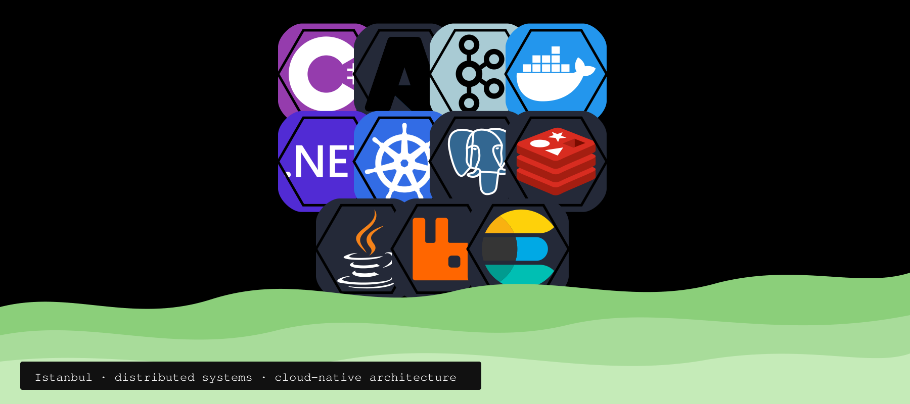

<h3 align="center">Hi, I'm Serhat</h3>

I'm a Solutions Architect. I design and build scalable, distributed, and cloud-native systems.

<h4 align="center">
  
  solutions architect <a href="https://www.linkedin.com/company/pathdevelop">@PATH</a>
  &nbsp;|&nbsp;
  
  building distributed systems
  &nbsp;|&nbsp;
  
  connect <a href="https://www.linkedin.com/in/serhatboyraz/">@serhatboyraz</a>
</h4>

  <a href="https://www.linkedin.com/in/serhatboyraz/">linkedin.com/in/serhatboyraz</a>
  &nbsp;·&nbsp;
  <a href="https://github.com/serhatboyraz">github.com/serhatboyraz</a>

 

<h3 align="center">Featured Projects</h3>

<table align="center" width="100%">
  <tr>
    <td align="center" valign="top" width="50%">
      <h4>AI Development Agent</h4>
      

        AI-powered software development workflow that takes work from the backlog to a reviewed merge request.
      

      

        <code>GitLab → Jira → AI Agent → Development → Tests → Code Review → Merge Request</code>
      

    </td>
    <td align="center" valign="top" width="50%">
      <h4>E-Signature Platform</h4>
      

        Enterprise electronic signature platform built with .NET. Integrates TÜBİTAK Esya with smart cards and HSM devices for legally compliant signing across e-invoice and e-dispatch flows.
      

    </td>
  </tr>
</table>

 

<h3 align="center">My Tech Stacks</h3>

  

Currently exploring Azure architecture, distributed systems, system design, and AI agents.

